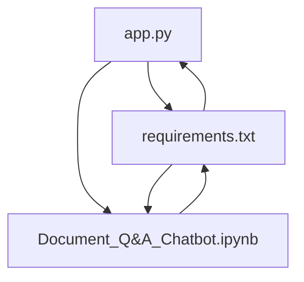
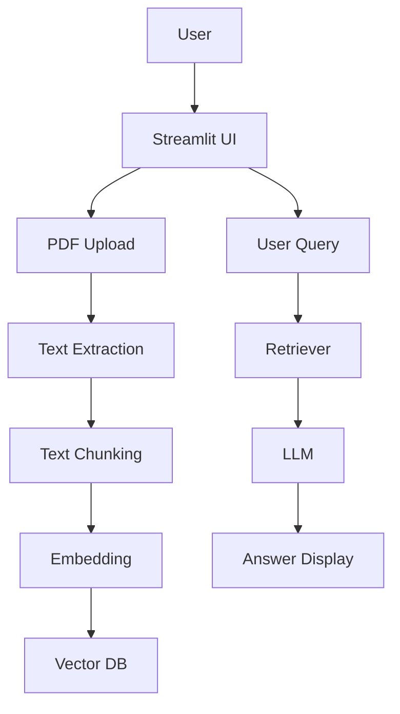
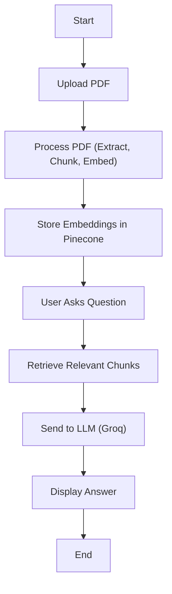
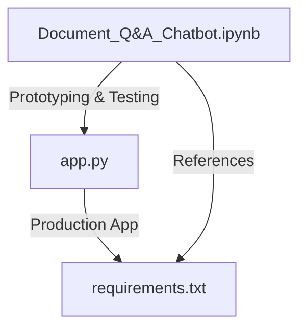

# Document Q&A Chatbot


---

## Table of Contents
- [Overview](#overview)
- [Features](#features)
- [File & Module Map](#file--module-map)
- [Setup & Installation](#setup--installation)
- [Usage](#usage)
- [Environment Variables](#environment-variables)
- [Dependencies](#dependencies)
- [Architecture](#architecture)
- [User Flow](#user-flow)
- [Development Workflow](#development-workflow)
- [Contributing](#contributing)
- [License](#license)

---

## Overview

**Document Q&A Chatbot** is a Streamlit-based application that allows users to upload PDF documents and interactively ask questions about their content. It leverages:
- **LangChain** for text chunking, embedding, and retrieval
- **Pinecone** as a vector database for semantic search
- **GROQ LLM** for generating answers
- **HuggingFace Sentence Transformers** for embeddings

The app is ideal for extracting insights from research papers, reports, or any PDF document.

---

## Features

| Feature                        | Description                                                      |
|-------------------------------|------------------------------------------------------------------|
| PDF Upload                    | Upload any PDF document via the web UI                            |
| Text Extraction & Chunking    | Extracts and splits text for efficient retrieval                  |
| Embedding & Vector Storage    | Uses sentence-transformers and Pinecone for semantic search       |
| Conversational Q&A            | Ask questions and get context-aware answers                       |
| Source Attribution            | Answers include page/source references when possible              |
| Streamlit UI                  | Clean, interactive, and responsive web interface                  |
| Error Handling                | User-friendly error messages and feedback                         |

---

## File & Module Map

| File                          | Purpose                                                        |
|------------------------------|----------------------------------------------------------------|
| `app.py`                     | Main Streamlit app: UI, PDF upload, embedding, Q&A logic        |
| `requirements.txt`           | Lists all Python dependencies                                   |
| `Document_Q&A_Chatbot.ipynb` | Jupyter notebook for prototyping and pipeline testing           |



---

## Setup & Installation

1. **Clone the repository:**
   ```bash
   git clone <repo-url>
   cd Q&A_Chatbot
   ```
2. **Install dependencies:**
   ```bash
   pip install -r requirements.txt
   ```
3. **Set up environment variables:**
   Create a `.env` file in the project root with the following keys:
   ```env
   GROQ_API_KEY=your_groq_api_key
   PINECONE_API_KEY=your_pinecone_api_key
   PINECONE_ENV=your_pinecone_env
   ```
4. **Run the app:**
   ```bash
   streamlit run app.py
   ```

---

## Usage

- Open the app in your browser (Streamlit will provide a local URL).
- Upload a PDF document using the sidebar.
- Click "Process Document" to extract and embed the content.
- Ask questions in the chat input and receive answers with references.

---

## Environment Variables

| Variable           | Description                                 | Required |
|--------------------|---------------------------------------------|----------|
| `GROQ_API_KEY`     | API key for GROQ LLM                        | Yes      |
| `PINECONE_API_KEY` | API key for Pinecone vector database        | Yes      |
| `PINECONE_ENV`     | Pinecone environment (e.g., us-east-1-aws)  | Yes      |

---

## Dependencies

| Package                | Version   | Purpose                                      |
|------------------------|-----------|----------------------------------------------|
| streamlit              | 1.33.0    | Web app framework                            |
| python-dotenv          | 1.0.0     | Load environment variables                   |
| pinecone-client        | 3.0.0     | Pinecone vector DB client                    |
| sentence-transformers  | 2.5.1     | Text embedding models                        |
| langchain              | 0.1.4     | LLM orchestration and retrieval              |
| langchain-groq         | 0.1.4     | GROQ LLM integration for LangChain           |
| langchain-community    | 0.0.13    | Community integrations for LangChain         |
| pdfplumber             | 0.10.3    | PDF text extraction                          |

---

## Architecture



---

## User Flow



---

## Development Workflow



---

## Contributing

Contributions are welcome! Please open issues or submit pull requests for improvements, bug fixes, or new features.

---

## License

This project is licensed under the MIT License. 