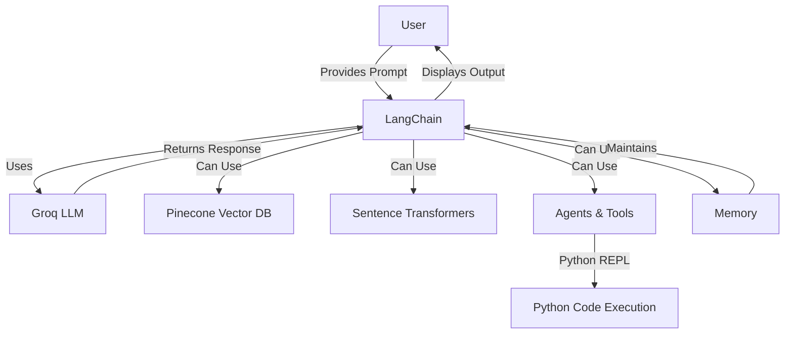
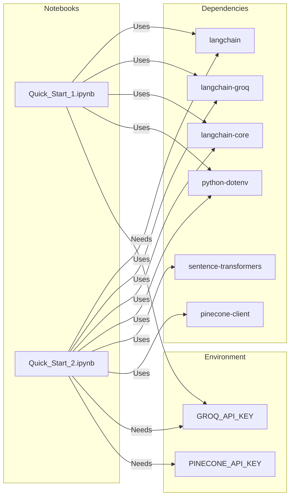
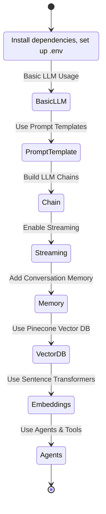

# LangChain + Groq Quick Start

[](https://www.python.org/)
[](https://python.langchain.com/)
[](https://groq.com/)
[](https://www.pinecone.io/)

---

## 🚀 Project Overview

This project provides a quick start for using [LangChain](https://python.langchain.com/) with [Groq](https://groq.com/) as the LLM provider. It demonstrates basic and advanced usage, including:
- LLM invocation
- Prompt templates
- Chains
- Streaming
- Memory
- Embeddings & Vector DB (Pinecone)
- Agents & Python tool integration

---

## 📁 File Structure

| File                  | Description                                      |
|-----------------------|--------------------------------------------------|
| `Quick_Start_1.ipynb` | Basic LangChain + Groq usage, streaming, memory  |
| `Quick_Start_2.ipynb` | Advanced: chains, embeddings, Pinecone, agents   |

---

## 🛠️ Dependencies

| Package                | Purpose                        |
|------------------------|--------------------------------|
| `langchain`            | Core framework                 |
| `langchain-groq`       | Groq LLM integration           |
| `langchain-core`       | Core utilities                 |
| `python-dotenv`        | Env variable management        |
| `sentence-transformers`| Embeddings                     |
| `pinecone-client`      | Vector DB integration          |

Install with:
```bash
pip install langchain langchain-groq langchain-core python-dotenv sentence-transformers pinecone-client
```

---

## 🔑 Environment Variables

| Variable         | Description                |
|------------------|---------------------------|
| `GROQ_API_KEY`   | Groq API Key              |
| `PINECONE_API_KEY`| Pinecone API Key (optional, for vector DB) |

Create a `.env` file in your project root:
```env
GROQ_API_KEY=your_groq_api_key
PINECONE_API_KEY=your_pinecone_api_key
```

---

## 📓 Notebooks Overview

### 1. Quick_Start_1.ipynb
- **Setup**: Loads environment, initializes Groq LLM
- **Basic Usage**: Direct LLM invocation, prompt templates, chains
- **Streaming**: Handles long responses with streaming
- **Memory**: Adds conversation memory
- **Tips**: Model selection, rate limits, error handling

### 2. Quick_Start_2.ipynb
- **Dependencies**: Installation and imports
- **LLM & Prompts**: Advanced prompt templates, chains
- **Sequential Chains**: Chaining multiple LLM calls
- **Embeddings & Vector DB**: Uses sentence-transformers and Pinecone
- **Agents**: Integrates Python REPL tool for code execution

---

## 🗺️ Architecture Map



---

## 🔄 File & Dependency Map



---

## 🏗️ Workflow Overview



---

## 📈 Example Output

> **Q:** What is the capital of France?
>
> **A:** The capital of France is Paris.

> **Q:** Tell me a short story about a robot learning to paint
>
> **A:** (LLM-generated story about Zeta the robot artist)

---

## 📝 Notes
- **LangChain Deprecations:** Some classes/methods (e.g., `LLMChain`, `Chain.run`) are deprecated in latest LangChain. Use recommended alternatives for production.
- **Groq Models:** Supports `llama3-70b-8192`, `mixtral-8x7b-32768`, etc.
- **Pinecone:** Only needed for vector DB/embeddings features in `Quick_Start_2.ipynb`.

---

## 📚 References
- [LangChain Docs](https://python.langchain.com/)
- [Groq Console](https://console.groq.com/)
- [Pinecone Docs](https://docs.pinecone.io/)
- [Sentence Transformers](https://www.sbert.net/) 