# 🧠 Autonomous Research Agent

[](https://www.python.org/downloads/)
[](https://streamlit.io/)
[](https://github.com/stanfordnlp/dspy)

> An intelligent research assistant that helps you find and summarize academic papers using AI.

## 📊 System Architecture


## 🛠 Technology Stack


## 🚀 Features

```mermaid
graph LR
    A[Features] --> B[🔍 ArXiv Search]
    A --> C[📝 AI Summarization]
    A --> D[🎯 Custom Results]
    A --> E[🔄 Multi-LLM Support]
    A --> F[🎨 Web Interface]
    A --> G[🔐 Secure Auth]
    style A fill:#f8f9fa,stroke:#333,stroke-width:2px
    style B fill:#e3f2fd,stroke:#333
    style C fill:#e8f5e9,stroke:#333
    style D fill:#fff8e1,stroke:#333
    style E fill:#fce4ec,stroke:#333
    style F fill:#f3e5f5,stroke:#333
    style G fill:#e8eaf6,stroke:#333
```



- 🔍 **Search Capabilities**: Find relevant academic papers on ArXiv with natural language queries
- 📝 **AI Summarization**: Get concise, accurate summaries of research papers
- 🎯 **Customizable Results**: Adjust the number of papers (1-10) to fit your needs
- 🔄 **Flexible Backends**: Switch between Groq and HuggingFace LLM backends
- 🎨 **Intuitive UI**: Clean, responsive Streamlit-based interface
- 🔐 **Secure**: Local API key management with environment variables

## 📦 Installation

1. Clone the repository:
   ```bash
   git clone <repository-url>
   cd research-agent
   ```

2. Create and activate a virtual environment:
   ```bash
   python -m venv venv
   source venv/bin/activate  # On Windows: venv\Scripts\activate
   ```

3. Install dependencies:
   ```bash
   pip install -r autonomous_agent/requirements.txt
   ```

4. Set up environment variables:
   Create a `.env` file in the project root with your API keys:
   ```env
   GROQ_API_KEY=your_groq_api_key
   HF_MODEL_ID=google/flan-t5-large  # Optional: Default model if no Groq key
   ```

## 🏃‍♂️ Usage

1. Start the Streamlit app:
   ```bash
   streamlit run autonomous_agent/main.py
   ```

2. Open your browser and navigate to the provided local URL (usually `http://localhost:8501`)

3. Enter your API keys in the sidebar

4. Enter your research topic or question in the search box

5. Adjust the number of papers to retrieve using the slider

6. Click "Search and Summarize" to get AI-generated summaries of relevant papers

## 📁 Project Structure


| File/Directory | Description |
|----------------|-------------|
| `Research_Agent.ipynb` | Jupyter notebook for development and testing |
| `autonomous_agent/` | Main package directory |
| ├── `__pycache__/` | Python bytecode cache |
| ├── `dspy_modules.py` | DSPy modules for AI processing |
| ├── `main.py` | Streamlit application entry point |
| ├── `requirements.txt` | Python dependencies |
| └── `utils.py` | Utility functions |
| `README.md` | Project documentation |

## ⚙️ Configuration

### Environment Variables


| Variable | Required | Default | Description |
|----------|----------|---------|-------------|
| `GROQ_API_KEY` | No | - | API key for Groq service |
| `HF_MODEL_ID` | No | `google/flan-t5-large` | HuggingFace model ID (fallback) |

### Dependencies


- `streamlit` - Web application framework
- `dspy` - Framework for building AI systems
- `arxiv` - ArXiv API client
- `python-dotenv` - Environment variable management

## 🤝 Contributing


1. Fork the repository
2. Create your feature branch (`git checkout -b feature/AmazingFeature`)
3. Commit your changes (`git commit -m 'Add some AmazingFeature'`)
4. Push to the branch (`git push origin feature/AmazingFeature`)
5. Open a Pull Request

## 🙏 Acknowledgments

- Built with ❤️ using Streamlit and DSPy
- Paper search powered by ArXiv
- AI capabilities powered by Groq and HuggingFace models